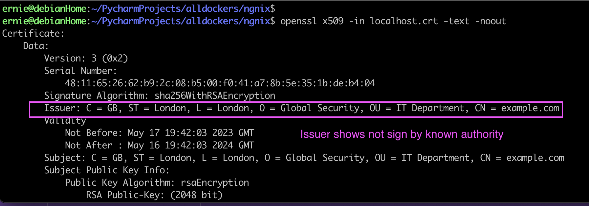
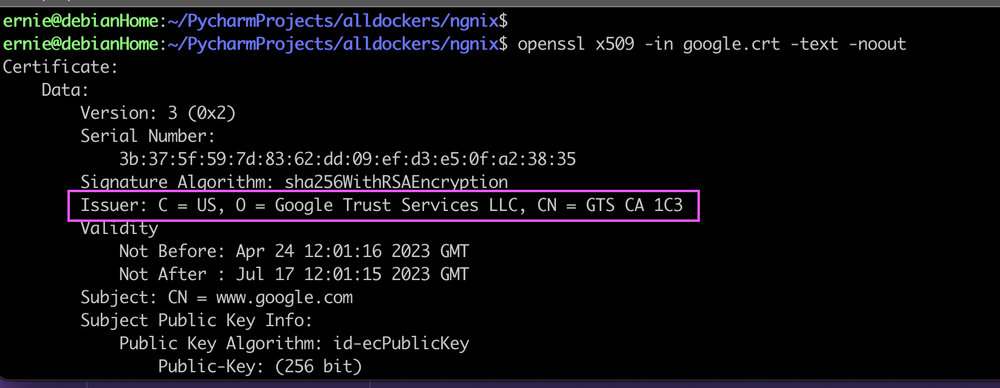

# docker_nginx_ssl

# Intro  

I wanne to have a server running ssl certificate. To get more familiar SSL.

This is a docker container running debian with SSL certificate on nginx.

# How to start it?

1. This will download Ubuntu latest image and install nginx with ssl certificate.
``` 
docker build -t ubuntu:1.1 . 
```

2. This will run the docker 
``` 
docker run -it --rm -d -p 8080:80 -p 443:443 --name my-ubuntu6 ubuntu:1.1 
``` 

3. Connect to the docker with terminal access
```
docker container exec -it my-ubuntu6 /bin/bash
```

4. nginx commands and starting up nginx server. 

```
ernie@debianHome:~/PycharmProjects/alldockers/ngnix$ docker container exec -it my-ubuntu6 /bin/bash
root@d9af3f5e4234:/#
root@d9af3f5e4234:/# service nginx status
 * nginx is not running
root@d9af3f5e4234:/#
root@d9af3f5e4234:/#
root@d9af3f5e4234:/# service nginx start
 * Starting nginx nginx                                                                                                                                                  [ OK ]
root@d9af3f5e4234:/#
root@d9af3f5e4234:/# nginx -t
nginx: the configuration file /etc/nginx/nginx.conf syntax is ok
nginx: configuration file /etc/nginx/nginx.conf test is successful
root@d9af3f5e4234:/# nginx -s reload
root@d9af3f5e4234:/#
```


# Difference between self sign and signed by known authority.

## Run openssl command on localhost port 443.
Here you see that the Certificate chain is broken. Does not have 1 and 2 in the chain.


```
ernie@debianHome:~/PycharmProjects/alldockers/ngnix$ openssl s_client -connect localhost:443
CONNECTED(00000003)
Can't use SSL_get_servername
depth=0 C = GB, ST = London, L = London, O = Global Security, OU = IT Department, CN = example.com
verify error:num=18:self signed certificate
verify return:1
depth=0 C = GB, ST = London, L = London, O = Global Security, OU = IT Department, CN = example.com
verify return:1
---
Certificate chain
 0 s:C = GB, ST = London, L = London, O = Global Security, OU = IT Department, CN = example.com
   i:C = GB, ST = London, L = London, O = Global Security, OU = IT Department, CN = example.com
---
Server certificate
```


## Run openssl command on Google port 443.
Google Certificate chain has 1 & 2
```
ernie@debianHome:~/PycharmProjects/alldockers/ngnix$ openssl s_client -connect www.google.com:443
CONNECTED(00000003)
depth=2 C = US, O = Google Trust Services LLC, CN = GTS Root R1
verify return:1
depth=1 C = US, O = Google Trust Services LLC, CN = GTS CA 1C3
verify return:1
depth=0 CN = www.google.com
verify return:1
---
Certificate chain
 0 s:CN = www.google.com
   i:C = US, O = Google Trust Services LLC, CN = GTS CA 1C3
 1 s:C = US, O = Google Trust Services LLC, CN = GTS CA 1C3
   i:C = US, O = Google Trust Services LLC, CN = GTS Root R1
 2 s:C = US, O = Google Trust Services LLC, CN = GTS Root R1
   i:C = BE, O = GlobalSign nv-sa, OU = Root CA, CN = GlobalSign Root CA
---
Server certificate
```




